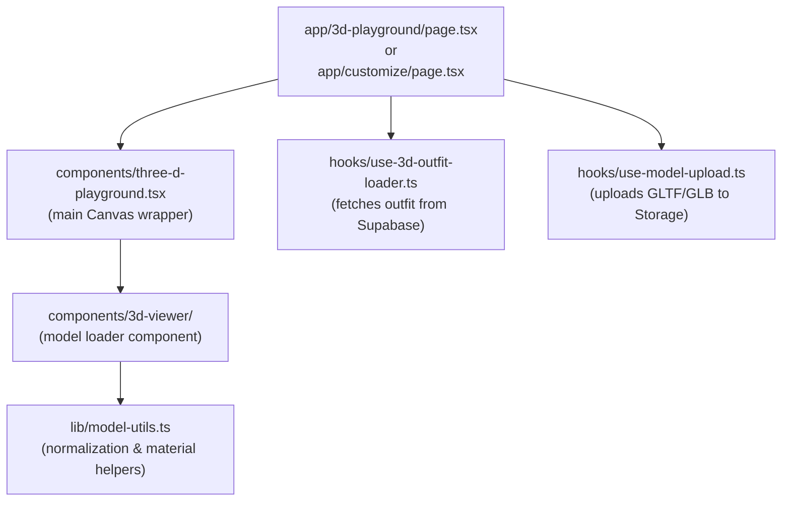
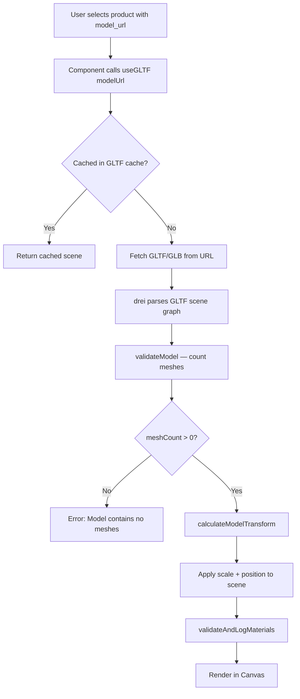
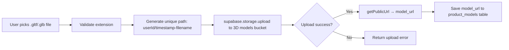

# 3D System

**Purpose:** Describes how the 3D rendering pipeline works — from loading a GLTF/GLB file to displaying it on screen with customizable materials.
**Related:** [ARCHITECTURE.md](./ARCHITECTURE.md) · [DATA_FLOW.md](./DATA_FLOW.md)

---

## Table of Contents

- [Overview](#overview)
- [Technology Stack](#technology-stack)
- [Component Hierarchy](#component-hierarchy)
- [Model Loading Pipeline](#model-loading-pipeline)
- [Model Normalization](#model-normalization)
- [Material System](#material-system)
- [Model Upload](#model-upload)
- [Key Files](#key-files)
- [Known Constraints](#known-constraints)

---

## Overview

The 3D system renders GLTF/GLB garment models on a 3D avatar inside a WebGL canvas. The system has two main entry points:

1. **`/customize` and `/outfit-picker`** — Outfit builder with product selection.
2. **`/3d-playground` and `/3d-preview`** — Standalone 3D viewer for free-form exploration.

The Three.js scene is managed through React components (`@react-three/fiber`), and helper utilities are provided by `@react-three/drei` (orbit controls, environment maps, loaders). Application-level 3D state (selected model URL, current color, etc.) is managed with [Valtio](https://valtio.pmnd.rs/) proxy store.

---

## Technology Stack

| Library | Role |
|---------|------|
| [Three.js](https://threejs.org/) | WebGL rendering engine |
| [@react-three/fiber](https://r3f.docs.pmnd.rs/) | React renderer for Three.js scenes |
| [@react-three/drei](https://drei.pmnd.rs/) | Helpers: `useGLTF`, `OrbitControls`, `Environment`, `PerspectiveCamera` |
| [maath](https://github.com/pmndrs/maath) | Math helpers used in animation loops |
| [Valtio](https://valtio.pmnd.rs/) | Proxy-based reactive state for 3D scene parameters |

---

## Component Hierarchy



---

## Model Loading Pipeline



Caching happens at two levels:
- **GLTF level**: `@react-three/drei` caches parsed GLTF files by URL in its internal store.
- **Transform level**: `lib/model-utils.ts` maintains a `processedModelsCache` Map keyed by URL, so `calculateModelTransform` is only computed once per model URL.

---

## Model Normalization

All GLTF/GLB files are normalized to a **1.8 metre height** regardless of their original dimensions. This ensures garments from different source assets layer consistently on the avatar.

**Source: `lib/model-utils.ts` — `calculateModelTransform()`**

```
1. Compute axis-aligned bounding box of the scene.
2. Measure height (Y-axis extent) of the bounding box.
3. If height is already within ±10% of 1.8 m → skip scaling.
4. Otherwise: scale = 1.8 / height.
5. Translate Y so that the bottom of the bounding box sits at y = 0 (feet on ground).
6. Compute facePosition = Vector3(0, scaledHeight × 0.85, 0) for camera targeting.
7. Cache result in processedModelsCache.
```

**Face height ratio:** 0.85 × total height is used as the approximate head position, giving the camera a good default look-at target.

**Error fallback:** If bounding box calculation fails (e.g., model has no geometry), the function returns `{ scale: 1, position: (0,0,0), facePosition: (0, 1.53, 0) }` — a safe default that will not crash the render.

---

## Material System

The material system provides three modes of operation:

### 1. Preserve Original Materials (default)

When the user has not selected a custom color (or the color is `#cccccc`), original PBR materials and textures from the GLTF file are preserved as-is.

```
applyMaterialColor(scene, "#cccccc") → no-op, original materials kept
```

### 2. Full Color Override

When the user picks a non-default color, all mesh materials are replaced with a `MeshStandardMaterial` of the chosen color:

```
applyMaterialColor(scene, "#ff5500") → all meshes get new MeshStandardMaterial
  roughness: 0.8, metalness: 0.0
```

Original materials are stored in `child.userData.originalMaterial` so they can be restored later.

### 3. Shirt-Only Color (`applyShirtColor`)

For models that have a named "shirt" mesh or "fabric" material, only that specific mesh is recolored — other meshes (skin, pants, shoes) keep their original materials.

```
applyShirtColor(scene, "#3399ff") → only meshes named "shirt" or materials named "fabric/shirt" are recolored
```

### Material Inspection (`validateAndLogMaterials`)

At load time, the system logs each material found in the scene (name, type, color, texture maps). This aids debugging when a model's materials are unexpected.

---

## Model Upload

Handled by `hooks/use-model-upload.ts`.



The public URL returned by Supabase Storage is stored in `product_models.model_url` and also in `products.model_url` as a convenience field.

---

## Key Files

| File | Role |
|------|------|
| `lib/model-utils.ts` | `calculateModelTransform`, `validateModel`, `validateAndLogMaterials`, `applyMaterialColor`, `applyShirtColor`, `restoreOriginalMaterials`, `clearModelCache` |
| `components/three-d-playground.tsx` | Main Three.js Canvas component with scene setup and controls |
| `components/3d-viewer/` | Modular GLTF viewer with loader state |
| `components/3d/` | Base scene, camera, lighting primitives |
| `hooks/use-3d-outfit-loader.ts` | Fetches saved outfit from Supabase and returns model URLs |
| `hooks/use-model-upload.ts` | File picker + Supabase Storage upload logic |

---

## Known Constraints

| Constraint | Detail |
|-----------|--------|
| **Format support** | Only `.gltf` and `.glb` formats; `.fbx`, `.obj`, `.dae` are not supported |
| **Scale assumption** | Models are assumed to represent human-scale garments. Non-human models will be scaled to 1.8 m height, which may look incorrect |
| **Shirt targeting** | `applyShirtColor` relies on mesh/material naming conventions (`"shirt"`, `"fabric"`). Models without these names will not be partially colored |
| **No physics** | Cloth simulation / physics is not implemented |
| **Single avatar** | The scene renders one avatar at a time; multi-avatar comparison is not currently supported |

---

## Related Documents

- [ARCHITECTURE.md](./ARCHITECTURE.md) — System architecture
- [DATA_FLOW.md](./DATA_FLOW.md) — 3D outfit builder data flow
- [SCHEMA_REFERENCE.md](../database/SCHEMA_REFERENCE.md) — `product_models`, `avatars`, `avatar_measurements` tables
