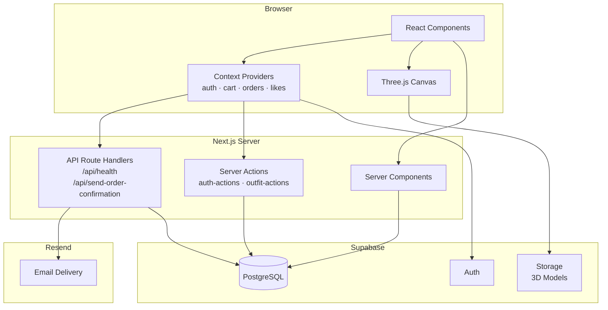

# Architecture Overview

**Purpose:** High-level description of the system architecture, module responsibilities, and design decisions.
**Related:** [DATA_FLOW.md](./DATA_FLOW.md) · [3D_SYSTEM.md](./3D_SYSTEM.md) · [SECURITY_MODEL.md](./SECURITY_MODEL.md)

---

## Table of Contents

- [Overview](#overview)
- [Tech Stack](#tech-stack)
- [High-Level Diagram](#high-level-diagram)
- [Module Map](#module-map)
  - [app/ — Pages and Route Handlers](#app--pages-and-route-handlers)
  - [components/ — UI Layer](#components--ui-layer)
  - [contexts/ — Global State](#contexts--global-state)
  - [lib/ — Data Access and Utilities](#lib--data-access-and-utilities)
  - [hooks/ — Reusable Behavior](#hooks--reusable-behavior)
  - [types/ — TypeScript Contracts](#types--typescript-contracts)
- [Key Design Decisions](#key-design-decisions)
- [Related Documents](#related-documents)

---

## Overview

3D Outfit Builder is a **Next.js 15 App Router** application. It follows a layered architecture:

1. **Presentation Layer** — React server and client components in `app/` and `components/`.
2. **State Layer** — React Context providers in `contexts/` for auth, cart, orders, and likes.
3. **Data Access Layer** — Supabase JS client wrappers in `lib/`.
4. **Compute Layer** — Next.js API Route Handlers and Server Actions in `app/api/` and `app/actions/`.
5. **3D Layer** — Three.js / react-three-fiber canvas components in `components/3d/`, `components/3d-viewer/`, and `hooks/`.

The backend is entirely **Supabase** (PostgreSQL + Auth + Storage). There is no custom application server — all server-side logic runs inside Next.js Route Handlers or Server Actions.

---

## Tech Stack

| Layer | Technology | Why |
|-------|-----------|-----|
| Framework | Next.js 15 (App Router) | Server Components, streaming, built-in API routes |
| Language | TypeScript 5 | Type safety across client and server |
| UI | React 19 + Tailwind CSS + shadcn/ui | Component ecosystem, utility-first styling |
| 3D | Three.js + @react-three/fiber + @react-three/drei | Full WebGL 3D rendering inside React |
| State | React Context + Valtio | Context for user-scoped data; Valtio for 3D proxy state |
| Database | Supabase (PostgreSQL) | Managed Postgres with Row Level Security |
| Auth | Supabase Auth | Email/password authentication with session management |
| Email | Resend | Transactional order confirmation emails |
| Animation | Framer Motion + GSAP | Page transitions and advanced timeline animations |
| Package Manager | pnpm 10 | Fast, disk-efficient dependency management |

---

## High-Level Diagram



---

## Module Map

### `app/` — Pages and Route Handlers

Next.js App Router. Each subfolder is a route segment.

| Path | Type | Purpose |
|------|------|---------|
| `app/page.tsx` | Server Component | Homepage — assembles landing sections |
| `app/layout.tsx` | Server Component | Root layout — wraps all providers |
| `app/auth/` | Client Page | Sign-in / sign-up |
| `app/products/` | Page | Product catalog with filters |
| `app/customize/` | Page | Outfit customization with 3D view |
| `app/3d-playground/` | Page | Free-form 3D model explorer |
| `app/3d-preview/` | Page | Read-only 3D outfit preview |
| `app/cart/` | Page | Shopping cart |
| `app/checkout/` | Page | Checkout form and order placement |
| `app/order-confirmation/` | Page | Post-checkout success page |
| `app/orders/` | Page | Order history |
| `app/dashboard/` | Page | User dashboard |
| `app/gallery/` | Page | Community outfit gallery |
| `app/outfit-picker/` | Page | Outfit selection interface |
| `app/preview/` | Page | Outfit preview |
| `app/profile/` | Page | User profile editor |
| `app/onboarding/` | Page | First-run onboarding wizard |
| `app/setup/` | Page | Admin / DB setup utilities |
| `app/test-auth/` | Page | Auth flow debugging |
| `app/test-connection/` | Page | Supabase connection test |
| `app/api/health/` | Route Handler | `GET /api/health` — liveness check |
| `app/api/send-order-confirmation/` | Route Handler | `POST /api/send-order-confirmation` — sends email |
| `app/actions/auth-actions.ts` | Server Action | `createUserProfile` |
| `app/actions/outfit-actions.ts` | Server Action | `saveOutfit`, `getUserOutfits`, `deleteOutfit` |

### `components/` — UI Layer

Presentation-only components. They receive data as props or from context and render UI.

| Directory / File | Purpose |
|-----------------|---------|
| `components/ui/` | shadcn/ui primitives (Button, Dialog, Toast, etc.) |
| `components/auth/` | Login, signup, and auth guard components |
| `components/cart/` | Cart sidebar and cart item cards |
| `components/3d/` | Base Three.js scene wrappers |
| `components/3d-viewer/` | GLTF/GLB model viewer component |
| `components/customizer/` | Color picker and style customization panels |
| `components/outfit-builder/` | Drag-and-drop outfit assembly UI |
| `components/filters/` | Product filter controls |
| `components/gallery/` | Outfit gallery grid |
| `components/dashboard/` | Dashboard stat widgets |
| `components/profile/` | Profile edit form |
| `components/onboarding/` | Multi-step onboarding wizard |
| `components/navbar.tsx` | Top navigation (auth state aware) |
| `components/landing-hero.tsx` | Animated homepage hero |
| `components/three-d-playground.tsx` | Full interactive Three.js playground |
| `components/outfit-picker.tsx` | Product-to-outfit selection UI |
| `components/checkout-form.tsx` | Checkout address and order form |
| `components/outfit-preview.tsx` | Outfit preview panel |
| `components/product-detail-modal.tsx` | Product detail overlay |
| `components/trending-outfits.tsx` | Trending outfits carousel |

### `contexts/` — Global State

All four contexts are composed in `app/layout.tsx`:

```
ThemeProvider
└── AuthProvider        ← user session, profile
    └── CartProvider    ← cart items, totals
        └── OrdersProvider  ← order history
            └── LikesProvider   ← liked product IDs
```

| Context | State Managed |
|---------|--------------|
| `AuthProvider` | `user`, `session`, `profile`, `signIn`, `signOut`, `signUp` |
| `CartProvider` | `items`, `addItem`, `removeItem`, `updateQuantity`, `clearCart` |
| `OrdersProvider` | `orders`, `fetchOrders`, `createOrder` |
| `LikesProvider` | `likedProducts`, `toggleLike` |

### `lib/` — Data Access and Utilities

| File / Directory | Purpose |
|-----------------|---------|
| `lib/supabase.ts` | Browser Supabase client (anon key, session persistence) |
| `lib/supabase-server.ts` | Server-side Supabase client (service role, no session) |
| `lib/supabase-safe.ts` | Null-safe wrapper; returns `null` when env vars are missing (build safety) |
| `lib/customization-utils.ts` | Avatar and saved outfit CRUD functions |
| `lib/model-utils.ts` | Three.js model normalization, material utilities |
| `lib/pricing.ts` | Price formatting and calculation |
| `lib/utils.ts` | `cn()` — Tailwind class merge utility |
| `lib/emails/` | Resend email template and `sendOrderConfirmationEmail()` |
| `lib/constants/` | Shared app constants |

### `hooks/` — Reusable Behavior

| Hook | Purpose |
|------|---------|
| `use-3d-outfit-loader.ts` | Fetches outfit data from Supabase and prepares it for Three.js |
| `use-mobile.ts` | Returns `true` when viewport is mobile-sized |
| `use-model-upload.ts` | Handles GLTF/GLB upload to Supabase Storage |
| `use-outfit-url-params.ts` | Reads and writes outfit configuration in URL query params |
| `use-toast.ts` | Wrapper around sonner toast notifications |
| `useFilters.js` | Product filtering state and logic |

### `types/` — TypeScript Contracts

| File | Purpose |
|------|---------|
| `types/supabase.ts` | Auto-generated database types; mirrors the Postgres schema |

---

## Key Design Decisions

### Why App Router (not Pages Router)?

Next.js App Router enables true React Server Components, which reduces the JavaScript bundle sent to the browser for catalog and profile pages. Server Actions allow form submissions without custom API routes.

### Why Two Supabase Clients?

- `lib/supabase.ts` uses the **anon key** and is safe in the browser. It respects Row Level Security.
- `lib/supabase-server.ts` uses the **service role key** and bypasses RLS — used only in Server Actions / Route Handlers where the server needs elevated privileges (e.g., profile creation after sign-up).

### Why React Context (not Zustand / Redux)?

The application's global state is small and user-scoped (cart, orders, likes, auth). React Context is sufficient and avoids adding a heavyweight store dependency. The exception is `valtio`, which is used for 3D scene state where proxy-based reactivity is a better fit.

### Why Supabase Storage for 3D Models?

Supabase Storage provides bucket-level and file-level access control via RLS, which integrates naturally with the existing auth model. Users' uploaded GLTF/GLB models are stored per-user in a dedicated bucket.

---

## Related Documents

- [DATA_FLOW.md](./DATA_FLOW.md) — How data moves through the system
- [3D_SYSTEM.md](./3D_SYSTEM.md) — 3D pipeline details
- [SECURITY_MODEL.md](./SECURITY_MODEL.md) — Auth and RLS policies
- [docs/database/SCHEMA_REFERENCE.md](../database/SCHEMA_REFERENCE.md) — Database schema
- [docs/api/API_REFERENCE.md](../api/API_REFERENCE.md) — API routes and Server Actions
