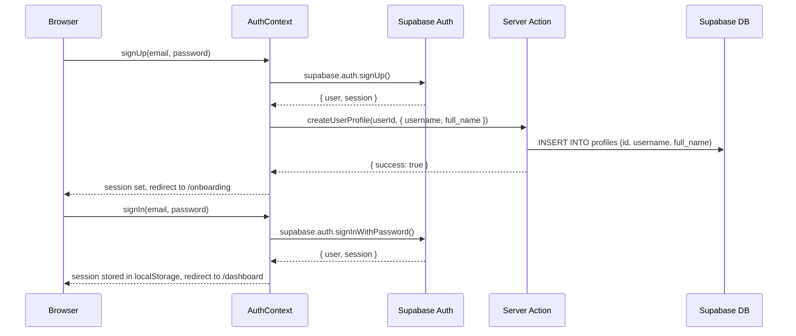
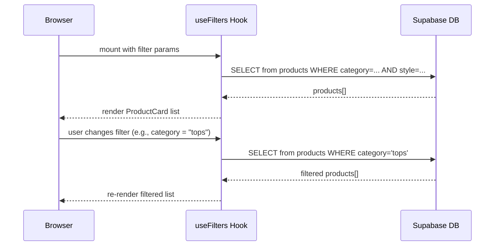
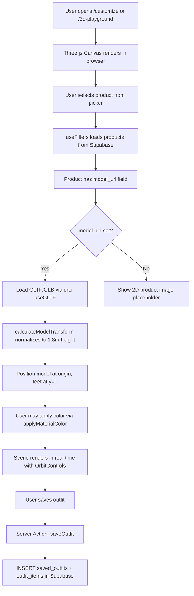
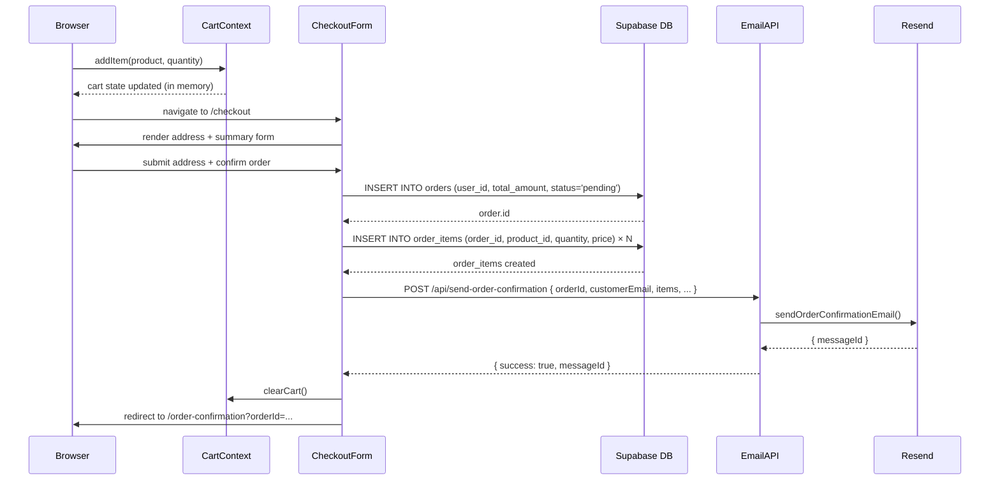
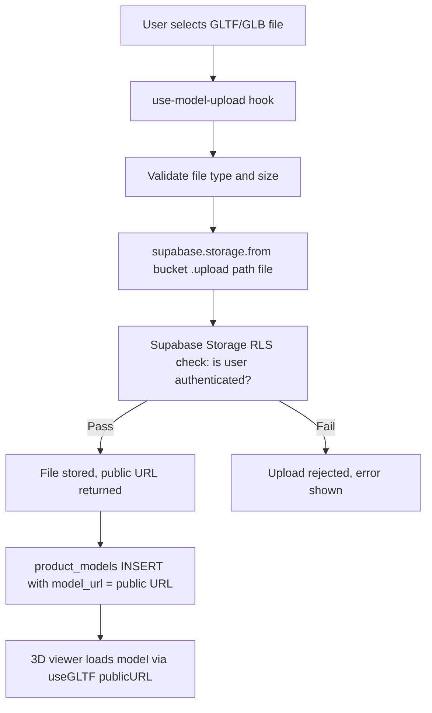

# Data Flow

**Purpose:** Documents how data enters, moves through, and exits the system for all key user interactions.
**Related:** [ARCHITECTURE.md](./ARCHITECTURE.md) · [SECURITY_MODEL.md](./SECURITY_MODEL.md) · [API_REFERENCE.md](../api/API_REFERENCE.md)

---

## Table of Contents

- [Authentication Flow](#authentication-flow)
- [Product Catalog Flow](#product-catalog-flow)
- [3D Outfit Builder Flow](#3d-outfit-builder-flow)
- [Cart and Checkout Flow](#cart-and-checkout-flow)
- [Order Confirmation Email Flow](#order-confirmation-email-flow)
- [Saved Outfit Flow](#saved-outfit-flow)
- [Model Upload Flow](#model-upload-flow)

---

## Authentication Flow



**Why:** `createUserProfile` runs in a Server Action using the service role key, because the user's session is not yet established when the profile row must first be created. The anon-key client cannot insert a profile row without an active session.

---

## Product Catalog Flow



Products are publicly readable (RLS policy: `Anyone can view products`). No authentication is required to browse the catalog.

---

## 3D Outfit Builder Flow



**Model normalization** ensures that GLTF/GLB files from different sources all appear at the same scale. The `calculateModelTransform` function in `lib/model-utils.ts` computes a scale factor so the model bounding box height equals 1.8 m, then positions it with feet at y=0.

---

## Cart and Checkout Flow



---

## Order Confirmation Email Flow

The email route is a separate Node.js runtime Route Handler to guarantee full Node.js API compatibility for the Resend SDK.

```mermaid
flowchart LR
    CheckoutForm -->|POST JSON| API[/api/send-order-confirmation]
    API -->|validate required fields| Validate{orderId + orderNumber + customerEmail present?}
    Validate -- No --> E400[400 Bad Request]
    Validate -- Yes --> Email[sendOrderConfirmationEmail via Resend]
    Email -- success --> R200[200 OK + messageId]
    Email -- fail --> R500[500 + error details]
```

**Required request body fields:** `orderId`, `orderNumber`, `customerEmail`.

Optional: `customerName`, `items[]`, `subtotal`, `shipping`, `tax`, `total`, `shippingAddress`, `trackingNumber`.

---

## Saved Outfit Flow

```mermaid
sequenceDiagram
    participant User
    participant OutfitBuilder
    participant Server Action: saveOutfit
    participant Supabase DB

    User->>OutfitBuilder: builds outfit (selects products, colors)
    User->>OutfitBuilder: clicks "Save Outfit"
    OutfitBuilder->>Server Action: saveOutfit(userId, { name, description, avatar_id, items[] })
    Server Action->>Supabase DB: INSERT INTO saved_outfits
    Supabase DB-->>Server Action: saved_outfits.id
    Server Action->>Supabase DB: INSERT INTO outfit_items (outfit_id, product_id, position_data, customization_data)
    Supabase DB-->>Server Action: outfit_items created
    Server Action-->>OutfitBuilder: { success: true, outfit }
    OutfitBuilder-->>User: toast "Outfit saved!"
```

`deleteOutfit` in the Server Action first verifies `outfit.user_id === userId` before deleting, providing server-side ownership validation even though RLS also enforces this at the database level.

---

## Model Upload Flow



---

## Related Documents

- [ARCHITECTURE.md](./ARCHITECTURE.md) — Module responsibilities
- [3D_SYSTEM.md](./3D_SYSTEM.md) — 3D rendering pipeline
- [SECURITY_MODEL.md](./SECURITY_MODEL.md) — RLS enforcement details
- [API_REFERENCE.md](../api/API_REFERENCE.md) — Route Handler specs
