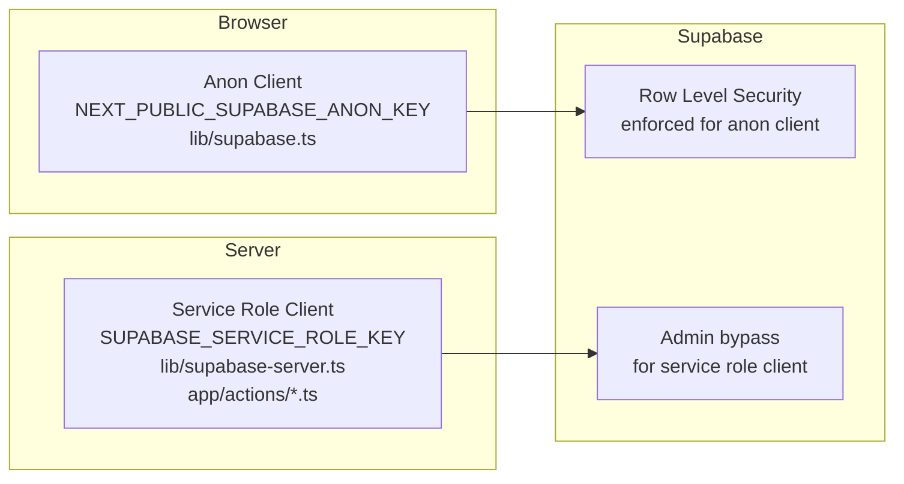

# Security Model

**Purpose:** Documents how authentication, authorization, and Row Level Security (RLS) are implemented.
**Related:** [ARCHITECTURE.md](./ARCHITECTURE.md) · [SCHEMA_REFERENCE.md](../database/SCHEMA_REFERENCE.md)

---

## Table of Contents

- [Authentication](#authentication)
- [Client Types and Key Hierarchy](#client-types-and-key-hierarchy)
- [Row Level Security Overview](#row-level-security-overview)
- [RLS Policies by Table](#rls-policies-by-table)
- [Server-Side Authorization](#server-side-authorization)
- [Environment Variable Security](#environment-variable-security)
- [Known Security Posture](#known-security-posture)

---

## Authentication

Authentication is handled entirely by **Supabase Auth**. The application uses **email/password** sign-up and sign-in. There is no OAuth / social login configured in the source code.

**Session management:**
- The browser client (`lib/supabase.ts`) is initialized with `autoRefreshToken: true` and `persistSession: true`, so sessions survive page refreshes and are stored in `localStorage`.
- The server client (`lib/supabase-server.ts`) uses `autoRefreshToken: false` and `persistSession: false`, because it runs in stateless Next.js Server Actions / Route Handlers and must not cache user sessions on the server.

**Profile creation:**
After a user signs up, `createUserProfile` (a Server Action in `app/actions/auth-actions.ts`) inserts a row into `public.profiles` using the **service role client** — bypassing RLS — because the new user's session is not yet established when the profile must first be created.

---

## Client Types and Key Hierarchy



| Client | Key Used | Respects RLS | Used In |
|--------|---------|-------------|---------|
| Browser (anon) | `NEXT_PUBLIC_SUPABASE_ANON_KEY` | ✅ Yes | `lib/supabase.ts`, `contexts/`, `lib/customization-utils.ts` |
| Server (service role) | `SUPABASE_SERVICE_ROLE_KEY` | ❌ Bypasses | `lib/supabase-server.ts`, `app/actions/auth-actions.ts`, `app/actions/outfit-actions.ts` |

> **Important:** The service role key **must never** be sent to or exposed in the browser. It is only used in `"use server"` files.

---

## Row Level Security Overview

RLS is enabled on all user-data tables. Catalog tables (`products`, `categories`, `sizes`, `colors`, etc.) are publicly readable.

```mermaid
graph LR
    subgraph Public Read Tables
        P[products]
        CAT[categories]
        SZ[sizes]
        COL[colors]
        PT[product_tags]
        PI[product_images]
        PM[product_models]
        PTR[product_tag_relations]
        PV[product_variants]
    end

    subgraph User-Scoped Tables
        PR[profiles]
        AV[avatars]
        AVM[avatar_measurements]
        SO[saved_outfits]
        OI[outfit_items]
        FAV[favorites]
        ORD[orders]
        ORI[order_items]
    end

    AnonymousUser -->|SELECT only| Public Read Tables
    AuthenticatedUser -->|SELECT only| Public Read Tables
    AuthenticatedUser -->|SELECT + INSERT + UPDATE + DELETE own rows| User-Scoped Tables
```

---

## RLS Policies by Table

### `profiles`

| Operation | Policy | Condition |
|-----------|--------|-----------|
| SELECT | Users can view own profile | `auth.uid() = id` |
| UPDATE | Users can update own profile | `auth.uid() = id` |
| INSERT | Users can insert own profile | `auth.uid() = id` |

### `categories`, `products`, `sizes`, `colors`, `product_tags`, `product_tag_relations`, `product_images`, `product_models`, `product_variants`

| Operation | Policy | Condition |
|-----------|--------|-----------|
| SELECT | Anyone can view | `true` |

Write access to catalog tables is **not** granted through RLS policies (requires service role or Supabase dashboard).

### `avatars`

| Operation | Policy | Condition |
|-----------|--------|-----------|
| SELECT | Users can view own avatars | `auth.uid() = user_id` |
| INSERT | Users can create own avatars | `auth.uid() = user_id` |
| UPDATE | Users can update own avatars | `auth.uid() = user_id` |
| DELETE | Users can delete own avatars | `auth.uid() = user_id` |

### `avatar_measurements`

| Operation | Policy | Condition |
|-----------|--------|-----------|
| ALL | Users can manage own avatar measurements | Join to `avatars` where `auth.uid() = user_id` |

### `saved_outfits`

| Operation | Policy | Condition |
|-----------|--------|-----------|
| SELECT | Users can view own outfits | `auth.uid() = user_id` |
| SELECT | Anyone can view public outfits | `is_public = true` (from script 02; superseded in later migrations) |
| INSERT | Users can create own outfits | `auth.uid() = user_id` |
| UPDATE | Users can update own outfits | `auth.uid() = user_id` |
| DELETE | Users can delete own outfits | `auth.uid() = user_id` |

### `outfit_items`

| Operation | Policy | Condition |
|-----------|--------|-----------|
| SELECT | Users can view own outfit items | `EXISTS (SELECT 1 FROM orders WHERE orders.id = order_items.order_id AND orders.user_id = auth.uid())` |
| INSERT | Users can create own outfit items | Same ownership check |

### `orders`

| Operation | Policy | Condition |
|-----------|--------|-----------|
| SELECT | Users can view own orders | `auth.uid() = user_id` |
| INSERT | Users can create own orders | `auth.uid() = user_id` |
| UPDATE | Users can update own orders | `auth.uid() = user_id` |

### `order_items`

| Operation | Policy | Condition |
|-----------|--------|-----------|
| SELECT | Users can view own order items | JOIN to `orders` where `orders.user_id = auth.uid()` |
| INSERT | Users can create own order items | Same JOIN check |

### `favorites`

| Operation | Policy | Condition |
|-----------|--------|-----------|
| SELECT | Users can view own favorites | `auth.uid() = user_id` |
| INSERT | Users can create own favorites | `auth.uid() = user_id` |
| DELETE | Users can delete own favorites | `auth.uid() = user_id` |

---

## Server-Side Authorization

Even with RLS, the following server-side ownership checks are applied in Server Actions:

**`deleteOutfit` (app/actions/outfit-actions.ts):**
```
1. Fetch saved_outfits WHERE id = outfitId
2. If outfit.user_id !== userId → return { success: false, error: "Unauthorized" }
3. Only then execute DELETE
```

This provides defense-in-depth: both the application layer and the database layer enforce ownership.

---

## Environment Variable Security

| Variable | Exposure | Risk if Leaked |
|---------|---------|---------------|
| `NEXT_PUBLIC_SUPABASE_URL` | Public (browser) | Low — project URL only |
| `NEXT_PUBLIC_SUPABASE_ANON_KEY` | Public (browser) | Low — RLS limits scope |
| `SUPABASE_SERVICE_ROLE_KEY` | Server only | **Critical** — bypasses all RLS |
| `RESEND_API_KEY` | Server only | High — allows sending email as your domain |
| `RESEND_FROM_EMAIL` | Server only | Low — only sender address |

`SUPABASE_SERVICE_ROLE_KEY` and `RESEND_API_KEY` must **never** appear in:
- Client components
- `NEXT_PUBLIC_` prefixed variables
- Git history
- Client-side bundle (verify with `pnpm build` output)

---

## Known Security Posture

| Area | Status | Notes |
|------|--------|-------|
| RLS on all user tables | ✅ Enabled | See scripts 02, 07, 11, 15 |
| Service role key server-only | ✅ Correct | Only in `"use server"` files |
| Auth session persistence | ✅ Configured | `localStorage` on browser, stateless on server |
| Catalog write protection | ✅ No public write policies | INSERT/UPDATE/DELETE on catalog requires service role |
| Server action ownership check | ✅ `deleteOutfit` | Double-checks ownership before delete |
| CORS / CSP headers | TODO — Requires Human Input | Not configured in `next.config.mjs` |
| Rate limiting on API routes | TODO — Requires Human Input | No rate limiting middleware found in source |
| SQL injection | ✅ Protected | Supabase JS client uses parameterized queries |

---

## Related Documents

- [ARCHITECTURE.md](./ARCHITECTURE.md) — System architecture
- [SCHEMA_REFERENCE.md](../database/SCHEMA_REFERENCE.md) — Database tables
- [ENVIRONMENT_SETUP.md](../deployment/ENVIRONMENT_SETUP.md) — Environment variable reference
