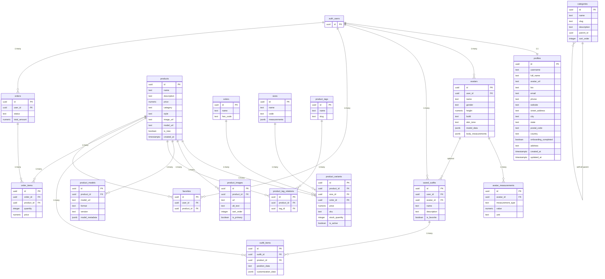

# Database Schema Reference

**Purpose:** Complete reference for every table in the `public` schema, including columns, types, constraints, and relationships.
**Source:** `docs/database-schema.sql` + `scripts/01-create-tables.sql` + `scripts/16-add-missing-tables.sql`
**Related:** [MIGRATION_INDEX.md](./MIGRATION_INDEX.md) · [schema-snapshot.sql](./schema-snapshot.sql) · [SECURITY_MODEL.md](../architecture/SECURITY_MODEL.md)

---

## Table of Contents

- [Entity Relationship Diagram](#entity-relationship-diagram)
- [Tables](#tables)
  - [profiles](#profiles)
  - [products](#products)
  - [categories](#categories)
  - [colors](#colors)
  - [sizes](#sizes)
  - [product\_variants](#product_variants)
  - [product\_images](#product_images)
  - [product\_models](#product_models)
  - [product\_tags](#product_tags)
  - [product\_tag\_relations](#product_tag_relations)
  - [avatars](#avatars)
  - [avatar\_measurements](#avatar_measurements)
  - [saved\_outfits](#saved_outfits)
  - [outfit\_items](#outfit_items)
  - [favorites](#favorites)
  - [orders](#orders)
  - [order\_items](#order_items)
- [Extensions Required](#extensions-required)
- [RLS Summary](#rls-summary)

---

## Entity Relationship Diagram



---

## Tables

### `profiles`

Extends `auth.users` with user-facing profile data. The `id` column is a 1:1 FK to `auth.users(id)`.

| Column | Type | Nullable | Default | Description |
|--------|------|---------|---------|-------------|
| `id` | uuid | NOT NULL | — | FK to `auth.users(id)`, primary key |
| `username` | text | NULL | — | Unique display name |
| `full_name` | text | NULL | — | User's full name |
| `avatar_url` | text | NULL | — | URL to profile picture |
| `bio` | text | NULL | — | Short biography |
| `email` | text | NULL | — | Email address (copy from auth) |
| `phone` | text | NULL | — | Phone number |
| `website` | text | NULL | — | Personal website URL |
| `street_address` | text | NULL | — | Street address |
| `city` | text | NULL | — | City |
| `state` | text | NULL | — | State / province |
| `postal_code` | text | NULL | — | Postal / ZIP code |
| `country` | text | NULL | — | Country |
| `onboarding_completed` | boolean | NULL | `false` | Whether the user has completed the onboarding wizard |
| `created_at` | timestamptz | NULL | `now()` | Row creation timestamp |
| `updated_at` | timestamptz | NULL | `now()` | Last update timestamp |

**Why `onboarding_completed`:** Added in migration `14-add-onboarding-field.sql` to let the app redirect new users through the onboarding wizard on first login.

---

### `products`

Core product catalog table.

| Column | Type | Nullable | Default | Description |
|--------|------|---------|---------|-------------|
| `id` | uuid | NOT NULL | `uuid_generate_v4()` | Primary key |
| `name` | text | NOT NULL | — | Product name |
| `description` | text | NULL | — | Product description |
| `price` | numeric | NOT NULL | — | Base price |
| `category` | text | NOT NULL | — | One of: `tops`, `bottoms`, `accessories`, `shoes` |
| `style` | text | NOT NULL | — | One of: `casual`, `formal`, `streetwear`, `activewear` |
| `image_url` | text | NULL | — | Primary product image URL |
| `model_url` | text | NULL | — | Convenience field: URL to primary 3D model |
| `is_new` | boolean | NULL | `false` | Flag for "New Arrival" badge |
| `created_at` | timestamptz | NULL | `now()` | Creation timestamp |

**Constraints:**
- `category` CHECK: `ANY (ARRAY['tops', 'bottoms', 'accessories', 'shoes'])`
- `style` CHECK: `ANY (ARRAY['casual', 'formal', 'streetwear', 'activewear'])`

---

### `categories`

Hierarchical product category tree. Supports nested categories via `parent_id` self-reference.

| Column | Type | Nullable | Default | Description |
|--------|------|---------|---------|-------------|
| `id` | uuid | NOT NULL | `uuid_generate_v4()` | Primary key |
| `name` | text | NOT NULL | — | Display name |
| `slug` | text | NOT NULL UNIQUE | — | URL-friendly identifier |
| `description` | text | NULL | — | Category description |
| `parent_id` | uuid | NULL | — | FK to `categories(id)` for nesting |
| `sort_order` | integer | NULL | `0` | Display ordering |
| `created_at` | timestamptz | NULL | `now()` | — |
| `updated_at` | timestamptz | NULL | `now()` | — |

---

### `colors`

Color catalog for product variants.

| Column | Type | Nullable | Default | Description |
|--------|------|---------|---------|-------------|
| `id` | uuid | NOT NULL | `uuid_generate_v4()` | Primary key |
| `name` | text | NOT NULL | — | Color name (e.g., "Midnight Blue") |
| `hex_code` | text | NOT NULL | — | Hex color code (e.g., `#1a237e`) |
| `created_at` | timestamptz | NULL | `now()` | — |
| `updated_at` | timestamptz | NULL | `now()` | — |

---

### `sizes`

Size catalog. The `measurements` JSONB field stores optional metric measurements for size-specific fit data.

| Column | Type | Nullable | Default | Description |
|--------|------|---------|---------|-------------|
| `id` | uuid | NOT NULL | `uuid_generate_v4()` | Primary key |
| `name` | text | NOT NULL | — | Display name (e.g., "Medium") |
| `code` | text | NOT NULL | — | Short code (e.g., "M") |
| `measurements` | jsonb | NULL | — | Optional measurement data |
| `created_at` | timestamptz | NULL | `now()` | — |
| `updated_at` | timestamptz | NULL | `now()` | — |

---

### `product_variants`

Links a product to a specific size + color combination with its own price and stock.

| Column | Type | Nullable | Default | Description |
|--------|------|---------|---------|-------------|
| `id` | uuid | NOT NULL | `uuid_generate_v4()` | Primary key |
| `product_id` | uuid | NOT NULL | — | FK to `products(id)` |
| `size_id` | uuid | NULL | — | FK to `sizes(id)` |
| `color_id` | uuid | NULL | — | FK to `colors(id)` |
| `price` | numeric | NULL | — | Variant-specific price override |
| `sku` | text | NULL | — | Stock-keeping unit |
| `stock_quantity` | integer | NULL | `0` | Available stock |
| `is_active` | boolean | NULL | `true` | Whether this variant is available |
| `created_at` | timestamptz | NULL | `now()` | — |
| `updated_at` | timestamptz | NULL | `now()` | — |

---

### `product_images`

Multiple images per product with ordering and primary flag.

| Column | Type | Nullable | Default | Description |
|--------|------|---------|---------|-------------|
| `id` | uuid | NOT NULL | `uuid_generate_v4()` | Primary key |
| `product_id` | uuid | NOT NULL | — | FK to `products(id)` |
| `url` | text | NOT NULL | — | Image URL |
| `alt_text` | text | NULL | — | Accessibility alt text |
| `sort_order` | integer | NULL | `0` | Display order |
| `is_primary` | boolean | NULL | `false` | Whether this is the main product image |
| `created_at` | timestamptz | NULL | `now()` | — |
| `updated_at` | timestamptz | NULL | `now()` | — |

---

### `product_models`

3D model files (GLTF/GLB) associated with a product.

| Column | Type | Nullable | Default | Description |
|--------|------|---------|---------|-------------|
| `id` | uuid | NOT NULL | `uuid_generate_v4()` | Primary key |
| `product_id` | uuid | NOT NULL | — | FK to `products(id)` |
| `model_url` | text | NOT NULL | — | URL to GLTF/GLB file (Supabase Storage) |
| `format` | text | NULL | — | File format (e.g., `glb`, `gltf`) |
| `version` | text | NULL | — | Model version identifier |
| `model_metadata` | jsonb | NULL | — | Additional metadata (dimensions, bone rig, etc.) |
| `created_at` | timestamptz | NULL | `now()` | — |
| `updated_at` | timestamptz | NULL | `now()` | — |

---

### `product_tags`

Taxonomy tags for filtering and discovery.

| Column | Type | Nullable | Default | Description |
|--------|------|---------|---------|-------------|
| `id` | uuid | NOT NULL | `uuid_generate_v4()` | Primary key |
| `name` | text | NOT NULL | — | Tag display name |
| `slug` | text | NOT NULL UNIQUE | — | URL-friendly identifier |
| `created_at` | timestamptz | NULL | `now()` | — |
| `updated_at` | timestamptz | NULL | `now()` | — |

---

### `product_tag_relations`

Many-to-many join table linking products to tags.

| Column | Type | Nullable | Default | Description |
|--------|------|---------|---------|-------------|
| `id` | uuid | NOT NULL | `uuid_generate_v4()` | Primary key |
| `product_id` | uuid | NOT NULL | — | FK to `products(id)` |
| `tag_id` | uuid | NOT NULL | — | FK to `product_tags(id)` |
| `created_at` | timestamptz | NULL | `now()` | — |

---

### `avatars`

User-defined 3D avatar configurations.

| Column | Type | Nullable | Default | Description |
|--------|------|---------|---------|-------------|
| `id` | uuid | NOT NULL | `uuid_generate_v4()` | Primary key |
| `user_id` | uuid | NOT NULL | — | FK to `auth.users(id)` |
| `name` | text | NOT NULL | — | Avatar display name |
| `gender` | text | NULL | — | One of: `male`, `female`, `other` |
| `height` | numeric | NULL | — | Height in cm |
| `build` | text | NULL | — | One of: `slim`, `average`, `athletic` |
| `skin_tone` | text | NULL | — | Skin tone descriptor or hex color |
| `model_data` | jsonb | NULL | — | Raw 3D model configuration data |
| `body_measurements` | jsonb | NULL | — | Body measurement key-value pairs |
| `created_at` | timestamptz | NULL | `now()` | — |
| `updated_at` | timestamptz | NULL | `now()` | — |

**Constraints:**
- `gender` CHECK: `ANY (ARRAY['male', 'female', 'other'])`
- `build` CHECK: `ANY (ARRAY['slim', 'average', 'athletic'])`

---

### `avatar_measurements`

Individual measurements for an avatar (normalized rows vs. the `body_measurements` JSONB field).

| Column | Type | Nullable | Default | Description |
|--------|------|---------|---------|-------------|
| `id` | uuid | NOT NULL | `uuid_generate_v4()` | Primary key |
| `avatar_id` | uuid | NOT NULL | — | FK to `avatars(id)` |
| `measurement_type` | text | NOT NULL | — | E.g., `chest`, `waist`, `inseam` |
| `value` | numeric | NOT NULL | — | Numeric value |
| `unit` | text | NOT NULL | — | E.g., `cm`, `in` |
| `created_at` | timestamptz | NULL | `now()` | — |
| `updated_at` | timestamptz | NULL | `now()` | — |

---

### `saved_outfits`

A named collection of products assembled into an outfit, optionally tied to an avatar.

| Column | Type | Nullable | Default | Description |
|--------|------|---------|---------|-------------|
| `id` | uuid | NOT NULL | `uuid_generate_v4()` | Primary key |
| `user_id` | uuid | NOT NULL | — | FK to `auth.users(id)` |
| `avatar_id` | uuid | NULL | — | FK to `avatars(id)` |
| `name` | text | NOT NULL | — | Outfit display name |
| `description` | text | NULL | — | Optional description |
| `is_favorite` | boolean | NULL | `false` | User-starred flag |
| `created_at` | timestamptz | NULL | `now()` | — |
| `updated_at` | timestamptz | NULL | `now()` | — |

---

### `outfit_items`

Individual products within a saved outfit, with optional position and customization data.

| Column | Type | Nullable | Default | Description |
|--------|------|---------|---------|-------------|
| `id` | uuid | NOT NULL | `uuid_generate_v4()` | Primary key |
| `outfit_id` | uuid | NOT NULL | — | FK to `saved_outfits(id)` |
| `product_id` | uuid | NOT NULL | — | FK to `products(id)` |
| `position_data` | text | NULL | — | Serialized 3D position/layer info |
| `customization_data` | jsonb | NULL | — | Color overrides, material settings, etc. |
| `created_at` | timestamptz | NULL | `now()` | — |

---

### `favorites`

User-liked products.

| Column | Type | Nullable | Default | Description |
|--------|------|---------|---------|-------------|
| `id` | uuid | NOT NULL | `uuid_generate_v4()` | Primary key |
| `user_id` | uuid | NOT NULL | — | FK to `auth.users(id)` |
| `product_id` | uuid | NOT NULL | — | FK to `products(id)` |
| `created_at` | timestamptz | NULL | `now()` | — |

---

### `orders`

Order header record.

| Column | Type | Nullable | Default | Description |
|--------|------|---------|---------|-------------|
| `id` | uuid | NOT NULL | `uuid_generate_v4()` | Primary key |
| `user_id` | uuid | NULL | — | FK to `auth.users(id)` |
| `status` | text | NOT NULL | — | One of: `pending`, `processing`, `shipped`, `delivered`, `cancelled` |
| `total_amount` | numeric | NOT NULL | — | Order total in base currency |
| `created_at` | timestamptz | NULL | `now()` | — |
| `updated_at` | timestamptz | NULL | `now()` | — |

**Constraints:**
- `status` CHECK: `ANY (ARRAY['pending', 'processing', 'shipped', 'delivered', 'cancelled'])`

---

### `order_items`

Line items for an order.

| Column | Type | Nullable | Default | Description |
|--------|------|---------|---------|-------------|
| `id` | uuid | NOT NULL | `uuid_generate_v4()` | Primary key |
| `order_id` | uuid | NOT NULL | — | FK to `orders(id)` |
| `product_id` | uuid | NULL | — | FK to `products(id)` (nullable: product may be deleted) |
| `quantity` | integer | NOT NULL | — | Quantity ordered |
| `price` | numeric | NOT NULL | — | Unit price at time of order |
| `created_at` | timestamptz | NULL | `now()` | — |

---

## Extensions Required

```sql
CREATE EXTENSION IF NOT EXISTS "uuid-ossp";
```

Required for `uuid_generate_v4()` used as default primary key values.

---

## RLS Summary

| Table | RLS Enabled | Public Read | User Write |
|-------|-----------|-------------|-----------|
| `profiles` | ✅ | ❌ | Own row only |
| `products` | ✅ | ✅ | ❌ (service role) |
| `categories` | ✅ | ✅ | ❌ (service role) |
| `colors` | ✅ | ✅ | ❌ (service role) |
| `sizes` | ✅ | ✅ | ❌ (service role) |
| `product_variants` | ✅ | ✅ | ❌ (service role) |
| `product_images` | ✅ | ✅ | ❌ (service role) |
| `product_models` | ✅ | ✅ | ❌ (service role) |
| `product_tags` | ✅ | ✅ | ❌ (service role) |
| `product_tag_relations` | ✅ | ✅ | ❌ (service role) |
| `avatars` | ✅ | ❌ | Own rows |
| `avatar_measurements` | ✅ | ❌ | Own rows (via avatar) |
| `saved_outfits` | ✅ | ❌ | Own rows |
| `outfit_items` | ✅ | ❌ | Own rows (via outfit) |
| `favorites` | ✅ | ❌ | Own rows |
| `orders` | ✅ | ❌ | Own rows |
| `order_items` | ✅ | ❌ | Own rows (via order) |
| `user_addresses` | ✅ | ❌ | Own rows |
| `user_preferences` | ✅ | ❌ | Own row only |

See [SECURITY_MODEL.md](../architecture/SECURITY_MODEL.md) for detailed policy SQL.

---

### `user_addresses`

Stores multiple shipping addresses per user. Introduced in migration `26-create-onboarding-database-foundation.sql`.

| Column | Type | Nullable | Default | Description |
|--------|------|---------|---------|-------------|
| `id` | uuid | NOT NULL | `uuid_generate_v4()` | Primary key |
| `user_id` | uuid | NOT NULL | — | FK to `auth.users(id)` |
| `full_name` | text | NULL | — | Full name for this address |
| `phone` | text | NULL | — | Contact phone for this address |
| `address_line_1` | text | NOT NULL | — | Street address line 1 |
| `address_line_2` | text | NULL | — | Street address line 2 (apt, suite, etc.) |
| `city` | text | NOT NULL | — | City |
| `state` | text | NULL | — | State / province |
| `country` | text | NOT NULL | — | Country |
| `postal_code` | text | NULL | — | Postal / ZIP code |
| `is_default` | boolean | NULL | `false` | Whether this is the user's default address |
| `created_at` | timestamptz | NULL | `now()` | Row creation timestamp |
| `updated_at` | timestamptz | NULL | `now()` | Last update timestamp |

**Constraint:** A database trigger (`ensure_single_default_address_trigger`) ensures only one address per user can have `is_default = true`.

---

### `user_preferences`

Stores a user's explicit fashion preferences for use in personalization and future recommendations. Introduced in migration `26-create-onboarding-database-foundation.sql`.

| Column | Type | Nullable | Default | Description |
|--------|------|---------|---------|-------------|
| `id` | uuid | NOT NULL | `uuid_generate_v4()` | Primary key |
| `user_id` | uuid | NOT NULL UNIQUE | — | FK to `auth.users(id)`, one record per user |
| `preferred_styles` | text[] | NULL | — | Array of style preferences (e.g., casual, formal) |
| `preferred_colors` | text[] | NULL | — | Array of preferred colors |
| `preferred_sizes` | text[] | NULL | — | Array of clothing sizes |
| `preferred_categories` | text[] | NULL | — | Array of preferred product categories |
| `preferred_occasions` | text[] | NULL | — | Array of occasions (e.g., work, wedding) |
| `created_at` | timestamptz | NULL | `now()` | Row creation timestamp |
| `updated_at` | timestamptz | NULL | `now()` | Last update timestamp |
