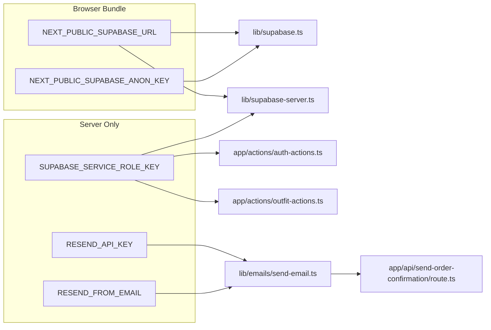

# Environment Setup

**Purpose:** Complete reference for all environment variables required by the application.
**Source:** `.env.example`, `lib/supabase.ts`, `lib/supabase-server.ts`, `app/actions/auth-actions.ts`, `app/api/send-order-confirmation/route.ts`
**Related:** [DEPLOYMENT_GUIDE.md](./DEPLOYMENT_GUIDE.md) · [SECURITY_MODEL.md](../architecture/SECURITY_MODEL.md)

---

## Table of Contents

- [Setup Instructions](#setup-instructions)
- [Variable Reference](#variable-reference)
  - [Supabase Variables](#supabase-variables)
  - [Resend Variables](#resend-variables)
  - [Auto-set Variables](#auto-set-variables)
- [Where Variables Are Used](#where-variables-are-used)
- [Security Checklist](#security-checklist)
- [Troubleshooting](#troubleshooting)

---

## Setup Instructions

```bash
# Copy the template
cp .env.example .env.local

# Open and fill in your values
# (never commit .env.local to version control)
```

`.env.local` is listed in `.gitignore`. Do not rename it to `.env` without verifying it is also excluded from git.

---

## Variable Reference

### Supabase Variables

Get all Supabase values from: **Supabase Dashboard → Project → Settings → API**

#### `NEXT_PUBLIC_SUPABASE_URL`

```
NEXT_PUBLIC_SUPABASE_URL=https://your-project-ref.supabase.co
```

| Property | Value |
|----------|-------|
| Required | ✅ Yes |
| Exposure | Public (browser) |
| Format | `https://<project-ref>.supabase.co` |
| Where used | `lib/supabase.ts`, `lib/supabase-server.ts`, `app/actions/*.ts` |

Your Supabase project's REST API URL. This is safe to expose to the browser. Found under **Settings → API → Project URL**.

---

#### `NEXT_PUBLIC_SUPABASE_ANON_KEY`

```
NEXT_PUBLIC_SUPABASE_ANON_KEY=eyJhbGciOiJIUzI1NiIsInR5...
```

| Property | Value |
|----------|-------|
| Required | ✅ Yes |
| Exposure | Public (browser) |
| Format | JWT string |
| Where used | `lib/supabase.ts` (browser client) |

The anonymous key for the Supabase project. It is scoped to Row Level Security — a malicious actor with this key can only read/write data that RLS policies permit. Found under **Settings → API → Project API keys → anon public**.

---

#### `SUPABASE_SERVICE_ROLE_KEY`

```
SUPABASE_SERVICE_ROLE_KEY=eyJhbGciOiJIUzI1NiIsInR5...
```

| Property | Value |
|----------|-------|
| Required | ✅ Yes |
| Exposure | **Server only — never expose to browser** |
| Format | JWT string |
| Where used | `lib/supabase-server.ts`, `app/actions/auth-actions.ts`, `app/actions/outfit-actions.ts` |

The service role key bypasses all Row Level Security. It must only be used in server-side code (`"use server"` files and Route Handlers). Found under **Settings → API → Project API keys → service_role secret**.

> **Caution:** If this key is leaked, a malicious actor can read and write any data in your database without restriction.

---

### Resend Variables

Get these from: **[resend.com/api-keys](https://resend.com/api-keys)**

#### `RESEND_API_KEY`

```
RESEND_API_KEY=re_your-api-key-here
```

| Property | Value |
|----------|-------|
| Required | ✅ Yes (for email confirmation) |
| Exposure | **Server only** |
| Format | `re_` prefixed string |
| Where used | `lib/emails/send-email.ts`, called from `app/api/send-order-confirmation/route.ts` |

Used to authenticate with the Resend API when sending order confirmation emails.

---

#### `RESEND_FROM_EMAIL`

```
RESEND_FROM_EMAIL=noreply@yourdomain.com
```

| Property | Value |
|----------|-------|
| Required | ✅ Yes (for email confirmation) |
| Exposure | Server only |
| Format | Email address |
| Where used | `lib/emails/send-email.ts` |

The sender email address for order confirmation emails. Must be a verified domain in your Resend account. Unverified domains will cause all email sends to fail.

---

### Auto-set Variables

These variables are set automatically by Next.js or the runtime — do **not** set them manually in `.env.local`.

| Variable | Set By | Value |
|---------|--------|-------|
| `NODE_ENV` | Next.js | `development` / `production` / `test` |

---

## Where Variables Are Used



---

## Security Checklist

- [ ] `.env.local` is in `.gitignore` and has never been committed
- [ ] `SUPABASE_SERVICE_ROLE_KEY` does not appear in any client component or `NEXT_PUBLIC_` variable
- [ ] `RESEND_API_KEY` does not appear in any client component
- [ ] Production environment variables are set in Vercel dashboard (not in files)
- [ ] `pnpm build` completes without referencing missing env vars

---

## Troubleshooting

| Symptom | Likely Cause | Fix |
|---------|-------------|-----|
| `Missing NEXT_PUBLIC_SUPABASE_URL` error on startup | Variable not set in `.env.local` | Add variable to `.env.local` |
| Supabase client returns `null` | Both anon key and URL missing at build time | `lib/supabase.ts` returns null when vars are missing; set vars and restart server |
| 500 on `/api/send-order-confirmation` | `RESEND_API_KEY` or `RESEND_FROM_EMAIL` not set, or sender domain unverified | Check Resend dashboard for domain verification status |
| Auth sign-up works but profile row missing | Service role key wrong or missing | Verify `SUPABASE_SERVICE_ROLE_KEY` in environment |
| `lib/supabase-server.ts` throws on startup | Service role key missing and anon key also missing | Both fallbacks unavailable; set `SUPABASE_SERVICE_ROLE_KEY` |
